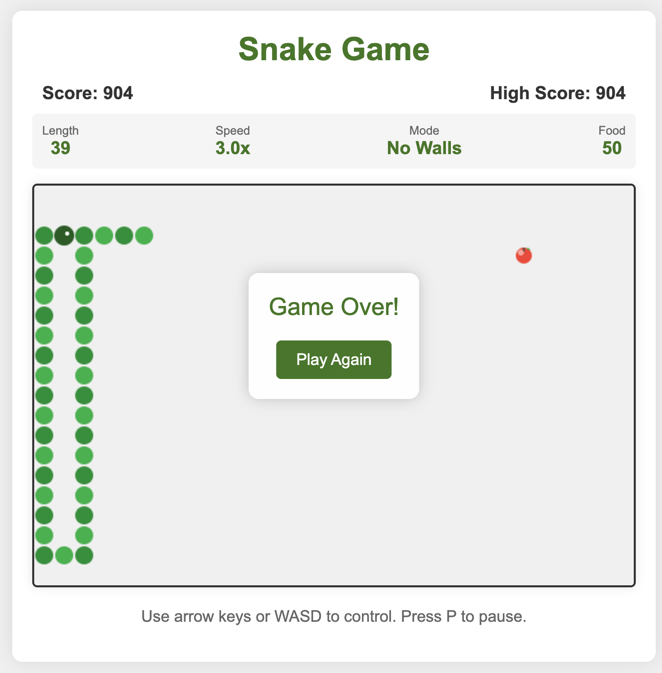

# Web Snake Game

[](https://opensource.org/licenses/MIT)

## Overview
A modern, responsive implementation of the classic Snake game built with HTML5, CSS3, and JavaScript. This web-based game offers smooth gameplay, responsive design, and modern visuals.



## Demo
[Play the game online](https://nj4x.github.io/web_snake/) (replace with actual demo link when available)

## Features
- Classic snake gameplay mechanics
- Multiple game modes: Classic and No Walls
- Three difficulty levels: Easy, Medium, and Hard
- Special food types with unique effects:
  - Regular food: increases score and length
  - Bonus food: higher points
  - Speed food: temporarily slows down the game
  - Shrink food: reduces snake length
- Score tracking with persistent high score
- Dynamic difficulty (game speeds up as you collect food)
- Responsive design that works on both desktop and mobile devices
- Background music with multiple tracks
- Sound effects for gameplay events
- Pause functionality and settings menu
- Game over and win conditions
- Touch controls for mobile devices

## How to Play
1. Open `index.html` in any modern web browser
2. Choose your game mode and difficulty
3. Click "Start Game" to begin
4. Control the snake using arrow keys or WASD keys
5. Collect food to grow the snake and increase your score
6. Avoid hitting the walls or the snake's own body
7. Press P to pause the game
8. Press M to toggle background music

## Mobile Controls
On mobile devices, you can control the snake using swipe gestures in any of the four directions.

## Game Modes
- **Classic**: Traditional snake game with wall collisions
- **No Walls**: Snake wraps around to the opposite side when it hits the edges

## Difficulty Levels
- **Easy**: Slower speed, mild acceleration, higher minimum speed
- **Medium**: Balanced speed and acceleration
- **Hard**: Faster initial speed, higher acceleration, lower minimum speed

## Technical Details
- Built with vanilla JavaScript, HTML5, and CSS3
- No external libraries or frameworks required
- Canvas-based rendering for smooth animations
- Web Audio API with fallback sound generation
- Local storage used for persisting high scores
- Fully responsive design

## Files
- `index.html` - Main HTML structure
- `styles.css` - Game styling
- `snake.js` - Game logic and functionality
- `audio/` - Background music tracks and fallback sound generation

## Installation
1. Clone this repository:
   ```
   git clone https://github.com/nj4x/web_snake.git
   ```
2. Open `index.html` in your browser

No build process or dependencies required!

## License
This project is licensed under the MIT License - see the [LICENSE](LICENSE) file for details.

## Credits
- Background music tracks from [Pixabay](https://pixabay.com/)
- Sound effects from [Mixkit](https://mixkit.co/)
- Apple icon based on public domain artwork